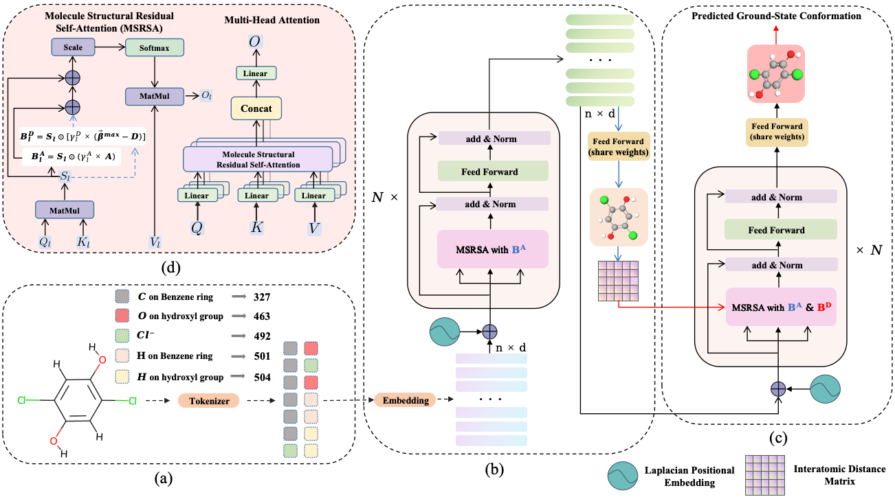

# GTMGC: Using Graph Transformer to Predict Molecule’s Ground-State Conformation

<!-- 添加openreview的图标并转到链接 -->
[](https://openreview.net/forum?id=F7QnIKlC1N&referrer=%5Bthe%20profile%20of%20Guikun%20Xu%5D(%2Fprofile%3Fid%3D~Guikun_Xu1))

The official implementation of the paper **"GTMGC: Using Graph Transformer to Predict Molecule’s Ground-State Conformation"** that has been accepted as a **Spotlight** presentation at **The Twelfth International Conference on Learning Representations (ICLR 2024)**.

<div align="center">

**Guikun Xu**, Yongquan Jiang, Pengchuan Lei, Yan Yang, Jim.X Chen

### Abstract

</div>

<div align="justify">

The ground-state conformation of a molecule is often decisive for its properties. However, experimental or computational methods, such as density functional theory (DFT), are time-consuming and labor-intensive for obtaining this conformation. Deep learning (DL) based molecular representation learning (MRL) has made significant advancements in molecular modeling and has achieved remarkable results in various tasks. Consequently, it has emerged as a promising approach for directly predicting the ground-state conformation of molecules. In this regard, we introduce GTMGC, a novel network based on Graph-Transformer (GT) that seamlessly predicts the spatial configuration of molecules in a 3D space from their 2D topological architecture in an end-to-end manner. Moreover, we propose a novel self-attention mechanism called Molecule Structural Residual Self-Attention (MSRSA) for molecular structure modeling. This mechanism not only guarantees high model performance and easy implementation but also lends itself well to other molecular modeling tasks. Our method has been evaluated on the Molecule3D benchmark dataset and the QM9 dataset. Experimental results demonstrate that our approach achieves remarkable performance and outperforms current state-of-the-art methods as well as the widely used open-source software RDkit.

<div align="center">

### Overview



</div>

## Environment

### Requirements

* python == 3.10.13
* pytorch == 2.1.0 (cuda 11.8 cudnn 8.7.0)
* pytorch Geometric == 2.4.0
* rdkit == 2022.03.2
* transformers == 4.32.1
* datasets == 2.14.6

### Install via Conda

```bash
# clone the environment
conda env create -f environment.yaml
# activate the environment
conda activate gtmgc
```

## Datasets


### official datasets 

The original official datasets can be found at [Molecule3D](https://github.com/divelab/MoleculeX/tree/molx/Molecule3D) and [Qm9](https://figshare.com/collections/Quantum_chemistry_structures_and_properties_of_134_kilo_molecules/978904).

### Reprocessed datasets

<!-- [](https://huggingface.co/datasets/RichXuOvO/HFMolecule3D)
[](https://huggingface.co/datasets/RichXuOvO/HFQm9) -->

For our experiment, we have reprocessed the original dataset files and uploaded the processed datasets ["HFMolecule3D"](https://huggingface.co/datasets/RichXuOvO/HFMolecule3D) and ["HFQm9"](https://huggingface.co/datasets/RichXuOvO/HFQm9) to the [Hugging Face](https://huggingface.co/) for enhanced user convenience.

## Experiments

### Molecule Tokenization

As an innovative point, the newly introduced context-aware [Mole-BERT Tokenizer](https://openreview.net/forum?id=jevY-DtiZTR) is creatively employed to categorize identical atoms into distinct subclasses, mitigating the quantitative divergence between prevalent and scarce atoms. Each atom of molecules is tokenized into discrete values with chemical significance (e.g., carbon to carbon in benzene ring or aldehyde.), serving as Input IDs to help the performance on ground-state conformation prediction.

#### Mole-BERT Tokenizer Training

```bash
cd /path/to/GTMGC   # replace with your root path of GTMGC
bash experiments/tokenizer_training/mol_bert_tokenizer_training.sh
```

**checkpoint:** We have hosted the trained checkpoint ["RichXuOvO/MoleBERT-Tokenizer"](https://huggingface.co/RichXuOvO/MoleBERT-Tokenizer) on Hugging Face. Users can download it to local "/path/to/tokenizer/checkpoint" or directly load the weights when tokenizing molecules.

#### Tokenize Molecules

```bash
cd /path/to/GTMGC   # replace with your root path of GTMGC
python -m tokenize_mole \
    --save_dir /path/to/save/tokenized/dataset/ \
    --dataset_name Molecule3D (or Qm9) \
    --mode random (or scaffold) \ # The split mode of Molecule3D.
    --tokenizer_checkpoint /path/to/tokenizer/checkpoint (or RichXuOvO/MoleBERT-Tokenizer) \
```

**note:** We also uploaded the tokenized datasets to [Google Drive](https://drive.google.com/drive/folders/1ENnLjrk087aHzYRr3zg517Zx39CygPUL?usp=drive_link) for users to download directly.

### Ground-State Conformation Prediction

As our main contribution, GTMGC, that predicts molecular 3D ground-state conformation from its 2D graph topological representation in an end-to-end manner, has been validated on the recently proposed benchmark dataset Molecule3D and the widely used QM9 dataset. Our method achieves significant performance improvement over the previous best methods, reaching the state-of-the-art level, and also surpasses the widely used open-source toolkit RDkit on various metrics.
#### Training

```bash
cd /path/to/GTMGC   # replace with your root path of GTMGC
bash expriments/conformer_prediction/gtmgc_for_conformer_prediction.sh
```

**note:** One should modify the tokenized dataset path or other hyperparameters in the script before running the training.

**checkpoints:** We have hosted the trained checkpoints ["RichXuOvO/GTMGC-Molecule3D-Random"](https://huggingface.co/RichXuOvO/GTMGC-Molecule3D-Random), ["RichXuOvO/GTMGC-Molecule3D-Scaffold"](https://huggingface.co/RichXuOvO/GTMGC-Molecule3D-Scaffold), ["RichXuOvO/GTMGC-Qm9"](https://huggingface.co/RichXuOvO/GTMGC-Qm9) on Hugging Face. Users can download it to local "/path/to/checkpoint" or directly load the weights when predicting ground-state conformations and evaluating the performance.

#### Evaluation

In order to evaluate this task, we have utilized RDKit for supplementary computations. Consequently, we’ve uploaded the sdf files of the original validation and test sets, which are used for evaluation, to [Google Drive](https://drive.google.com/drive/folders/1qwOiaowRkRWVfQWIXQ7HP1i3qiL55l69?usp=drive_link). Users are required to first download these files and then extract them to achieve the following file structure:

```
|-- data_dir
    |-- Molecule3D
        |-- random
          |-- valid.sdf
          |-- test.sdf
        |-- scaffold
          |-- valid.sdf
          |-- test.sdf
    |-- Qm9
        |-- gdb9.sdf
        |-- valid_indices.csv
        |-- test_indices.csv
```

```bash
cd /path/to/GTMGC   # replace with your root path of GTMGC
python -m evaluate \
    --data_dir /path/to/data_dir/ \
    --dataset Molecule3D \
    --mode random \ # The split mode of Molecule3D.
    --split test \ # The split of the dataset.
    --log_file /path/to/log_file.txt \
    --method GTMGC \
    --GTMGC_checkpoint RichXuOvO/GTMGC-Molecule3D-Random \ # The checkpoint of GTMGC.
    --MoleBERT_Tokenizer_checkpoint RichXuOvO/MoleBERT-Tokenizer \ # The checkpoint of MoleBERT Tokenizer.
    --device cuda:0 \ 
    --batch_size 100 \
```

### Molecular Property Prediction

As another innovative point of ours, we introduce a novel and simple self-attention mechanism for molecular structure modeling, namely Molecule Structural Residual Self-Attention(MSRSA). It preserves the original self-attention structure in Transformer to a large extent, while also being able to effectively model the molecular structure. It is easy to implement and generalize to other molecular modeling tasks, such as molecular property prediction.

#### Training

```bash
cd /path/to/GTMGC   # replace with your root path of GTMGC
# Make `--do_train` to `True` in the script.
bash experiments/graph_regression/gtmgc_for_graph_regression.sh 
```

**note:** One should modify the dataset or other hyperparameters in the script before running the training.

**checkpoints:** We have hosted the trained checkpoints ["RichXuOvO/GTMGC_Small-Molecule3D-Random-Gap](https://huggingface.co/RichXuOvO/GTMGC_Small-Molecule3D-Random-Gap), ["RichXuOvO/GTMGC_Base-Molecule3D-Random-Gap"](https://huggingface.co/RichXuOvO/GTMGC_Base-Molecule3D-Random-Gap), ["RichXuOvO/GTMGC_Large-Molecule3D-Random-Gap"](https://huggingface.co/RichXuOvO/GTMGC_Large-Molecule3D-Random-Gap) on Hugging Face. Users can download it to local "/path/to/checkpoint" or directly load the weights when predicting molecular properties and evaluating the performance.

#### Evaluation

```bash
cd /path/to/GTMGC   # replace with your root path of GTMGC
# Set the `--do_train` to `False` and `--do_eval` to `True` in the script and `--evaluation_only_checkpoint` to the path of the checkpoint to be evaluated.
bash experiments/graph_regression/gtmgc_for_graph_regression.sh 
```

## Citation

Please cite our paper if you find our work useful for your research:

```bibtex
@inproceedings{xu2024gtmgc,
  title={GTMGC: Using Graph Transformer to Predict Molecule’s Ground-State Conformation},
  author={Xu, Guikun and Jiang, Yongquan and Lei, PengChuan and Yang, Yan and Chen, Jim},
  booktitle={The Twelfth International Conference on Learning Representations},
  year={2024}
}
```

